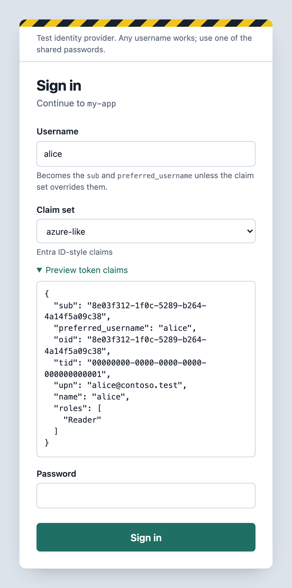
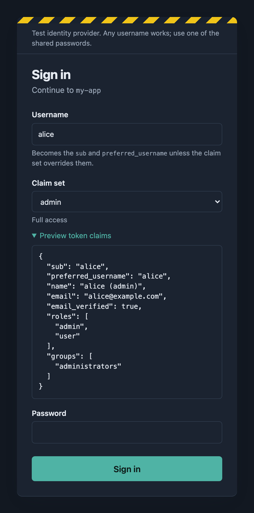
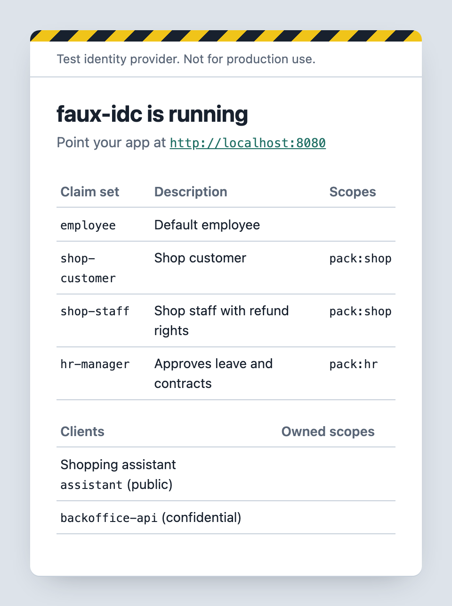
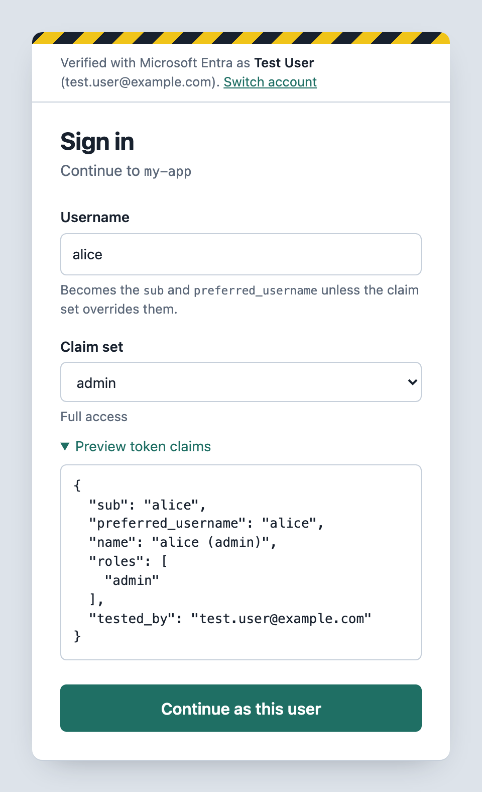

# faux-idc

[](https://github.com/domibies/faux-idc/actions/workflows/ci.yml)
[](https://github.com/domibies/faux-idc/pkgs/container/faux-idc)
[](https://github.com/domibies/faux-idc/pkgs/container/faux-idc)
[](LICENSE)

**A mock OpenID Connect provider for development and testing.** Sign in as any user, pick a claim
set, get real signed tokens. It runs as one small container, with no database and no setup.

<p align="center">
  
  &nbsp;
  
</p>

> **Warning:** Use faux-idc for development and testing only. Do not expose it where real users can sign in.

## Why faux-idc

A real identity provider makes local development and automated tests slow: you need test accounts,
a tenant, and someone to manage both. A full server such as Keycloak is a large dependency for a test
setup. faux-idc does only what an app needs to sign in:

- **Any username.** Type a name, select a claim set, enter a shared password, and you are signed in.
- **Named claim sets.** Define roles, groups and custom claims once in YAML, and select them on the form.
- **Live claims preview.** The form shows the exact claims that go into the tokens before you sign in.
- **Claim sets per scope.** An app can request a scope to get its own set of claim sets.
- **Live configuration.** Edit `config.yaml` and the next sign-in uses it. You do not restart anything.
- **Tokens for CI.** The password grant gives tokens to scripts and tests, without a browser.
- **Tokens for services.** The client credentials grant gives a confidential client a token without a user.
- **Standard OIDC.** Discovery, JWKS, authorization code flow with PKCE, refresh tokens, userinfo and logout.
- **Optional Microsoft Entra gate.** Only people in your Entra tenant can use a shared server.
- **Small image.** Node and one bundled JavaScript file, for `linux/amd64` and `linux/arm64`.

## Quick start

```bash
docker run -d -p 8080:8080 -v faux-idc-data:/data ghcr.io/domibies/faux-idc
```

Open <http://localhost:8080> to see the claim sets of the sample configuration. Then get a token:

```bash
curl -s localhost:8080/token -d grant_type=password -d client_id=demo \
  -d username=alice -d password=letmein -d claim_set=admin
```

## Use it from your app

Configure your app as for any OIDC provider:

| Setting | Value |
|---|---|
| Authority / issuer | `http://localhost:8080` |
| Client ID | Any value. If you configure `clients`, use one of those |
| Client secret | None. If you configure a secret for the client, use that secret |
| Redirect URI | Any value. If you configure `redirectUris` for the client, use one of those |
| Scopes | `openid profile`, plus a pack scope if you use [claim sets per scope](#claim-sets-per-scope) |
| Sign-in password | `letmein` or `test123` in the sample configuration |

When your app starts a sign-in, faux-idc shows the form. The username and the claim set that you
select go into the ID token, the access token and the userinfo response.

## Tokens without a browser

Scripts, tests and services can get a token directly from `/token`. faux-idc has two grants for this.

**Password grant.** Send a username, one of the global passwords and an optional `claim_set`. The
token has a user, as a token from the sign-in form has:

```bash
curl -s localhost:8080/token -d grant_type=password -d client_id=demo \
  -d username=alice -d password=letmein -d claim_set=admin
```

**Client credentials grant.** A service gets a token for itself, without a user. Use this grant for
calls from one app to another, for example from an ingest job or a seed script. Only a confidential
client can use this grant. A confidential client is a client in `clients` that has a `clientSecret`:

```yaml
clients:
  - clientId: ingest-job
    clientSecret: s3cret
    claimSet: minimal     # optional
```

```bash
curl -s localhost:8080/token -u ingest-job:s3cret \
  -d grant_type=client_credentials -d scope=api:write
```

The client sends its secret with HTTP Basic authentication (`client_secret_basic`, as in the example),
or as `client_id` and `client_secret` in the body (`client_secret_post`). The token is different from
a user token:

- The response contains only an access token. It contains no ID token and no refresh token.
- `sub` is the `client_id`, unless the claim set contains `sub`. In the claim values, `{{username}}`
  is the `client_id`. The token has no `preferred_username`.
- The requested scope goes into the `scope` claim. `aud` is `accessTokenAudience` or the `client_id`.

faux-idc selects the claim set in this order:

1. The `claim_set` parameter of the request.
2. The `claimSet` of the client.
3. The first claim set that is available for the requested scope.

The rules of [claim sets per scope](#claim-sets-per-scope) apply to the selected claim set. If the
scope does not allow that claim set, faux-idc returns `invalid_scope`. A public client gets
`unauthorized_client`. The discovery document lists `client_credentials` in `grant_types_supported`
only when at least one client has a `clientSecret`.

## Run

The image contains the sample configuration from [`config/config.yaml`](config/config.yaml).
To use your own configuration, mount a directory that contains a `config.yaml`:

```bash
docker run -d -p 8080:8080 \
  -v "$PWD/config:/config:ro" -v faux-idc-data:/data ghcr.io/domibies/faux-idc
```

With Docker Compose, run `docker compose up -d`. This uses the published image.
To build the image from the local source, run `docker compose up -d --build`.

| Image tag | Content |
|---|---|
| `latest` | The most recent release |
| `X.Y.Z`, `X.Y`, `X` | A specific release, or the most recent release in that line |

For a repeatable setup, pin a version tag.

## Configure

All settings are in `config/config.yaml`. The comments in that file explain each setting:
`issuer`, `passwords`, `claimSets`, optional `clients`, token lifetimes and `accessTokenAudience`.

**Changes apply live.** faux-idc reads the file again when it changes. On a server, edit
`config/config.yaml` and save it; the next sign-in uses the new configuration. If the file is not
valid, faux-idc logs the error and keeps the last valid configuration. Mount the *directory*
(`./config:/config`), not the single file. Some editors (for example vim) replace the file on save,
and a single-file bind mount does not show that change.

Claim values support `{{username}}`, `{{claimSet}}` and `{{uuid}}`. `{{uuid}}` is a stable UUID that
faux-idc calculates from the username. If a claim set contains `sub` or `aud`, that value replaces the
default. The default `sub` is the username, and the default access token `aud` is the `client_id`.

### Claim sets per scope

An app can select which claim sets the sign-in form offers. To do this, add `scopes` to a claim set:

```yaml
claimSets:
  default:
    claims: { name: "{{username}}" }
  shop-customer:
    scopes: [pack:shop]
    claims: { name: "{{username}}", customer_id: "{{uuid}}" }
  shop-staff:
    scopes: [pack:shop]
    claims: { name: "{{username}}", roles: [staff] }
```

faux-idc compares the `scope` of the request with these values:

- If the request contains a scope of one or more claim sets, faux-idc offers only those claim sets.
  In the example, `scope=openid pack:shop` offers `shop-customer` and `shop-staff`.
- If the request contains no such scope, faux-idc offers only the claim sets without `scopes`.
  In the example, `scope=openid` offers only `default`.
- If no claim set is available, faux-idc rejects the request.

The same rules apply to the password grant. Without `claim_set`, faux-idc uses the first available
claim set. The discovery document lists these scopes in `scopes_supported`. The scope also goes into
the `scope` claim of the access token. The home page shows the scopes of each claim set:

<p align="center">
  
</p>

### Environment variables

| Variable | Default | Purpose |
|---|---|---|
| `PORT` | `8080` | Listen port |
| `CONFIG_PATH` | `/config/config.yaml` | Location of the configuration file |
| `CONFIG_YAML` | – | Inline YAML. faux-idc uses it when the configuration file does not exist (useful for Kubernetes or CI) |
| `ISSUER` | from file, else from the request | Replaces `issuer` |
| `PASSWORDS` | from file | Comma-separated list. Replaces `passwords` |
| `SIGNING_KEY_PATH` | `/data/signing-key.pem` | RSA signing key. faux-idc creates it at the first start, so tokens stay valid after a restart |
| `SIGNING_KEY` | – | PEM content of the signing key (use `\n` for line breaks) |

## Endpoints

| Path | |
|---|---|
| `/.well-known/openid-configuration` | Discovery |
| `/.well-known/jwks.json` (also `/jwks`) | Public signing key (RS256) |
| `/authorize` | Authorization code flow, PKCE (S256/plain), `state`, `nonce`, `login_hint`, `prompt=none` → `login_required` |
| `/token` | `authorization_code`, `refresh_token` (rotating), `password`, `client_credentials` |
| `/userinfo` | Claims from the bearer access token |
| `/logout` | Redirects to `post_logout_redirect_uri` with `state` |

## Notes

- The issuer must be the URL that your app uses *and* validates. If you do not set `issuer`,
  faux-idc uses the URL of each request. Behind a reverse proxy, it uses the `X-Forwarded-Proto` and
  `X-Forwarded-Host` headers.
- Sometimes a backend container and a browser use different hostnames, for example
  `http://faux-idc:8080` and `http://localhost:8080`. In that case, set `issuer` to the browser URL.
  Then point the metadata or JWKS URL of the backend to the internal hostname. You can also use the
  same hostname for both.
- Codes and refresh tokens are in memory. A restart makes all refresh tokens invalid. Access tokens
  stay valid if the signing key is persistent.
- With `clients: []`, faux-idc accepts all values of `client_id` and `redirect_uri`, and does not check a secret.
  All clients are then public, so the client credentials grant is not available.
- All claims of a claim set go into the ID token, the access token and userinfo. The requested scope
  selects the claim sets, but it does not filter the claims in them.

## Optional: Microsoft Entra gate

When the gate is on, people first sign in with their real Microsoft Entra ID account. Then they see
the faux-idc form, with a username and a claim set but no password. The form still sets the content
of the tokens. Entra only controls *who can use* the server.

<p align="center">
  
</p>

1. Create an app registration with platform **Web** and redirect URI `<issuer>/entra/callback`.
2. Give faux-idc a credential for the app registration: a client secret, or a
   [federated credential](#sign-in-to-entra-without-a-client-secret).
3. Set `ENTRA_ENABLED=true`, `ENTRA_TENANT_ID`, `ENTRA_CLIENT_ID` and the settings of the credential.
   For a client secret, set `ENTRA_CLIENT_SECRET`. You can also use the `entra:` section in
   `config.yaml`. The `ENTRA_ENABLED` variable has priority over the file. For the other settings, a
   value in the file has priority over the environment variable.
4. Decide who can sign in. The simplest method is to set *Assignment required* on the enterprise
   application, and then assign users or groups there. You can also use `allowedUsers`
   (`"*@contoso.com"`), `allowedGroups` or `allowedRoles` in the configuration.

Details:
- faux-idc keeps the Entra check for `sessionTtl` (default 8 hours) in a signed HttpOnly cookie.
  *Switch account* on the form selects a different Microsoft account. `/entra/logout` deletes the cookie.
- Claim values can refer to the real person: `{{entraName}}`, `{{entraUsername}}`, `{{entraEmail}}`, `{{entraOid}}`.
- The `password` grant is off while the gate is on, unless you set `entra.allowPasswordGrant: true`.
- The `client_credentials` grant stays on while the gate is on. The client secret already proves who
  asks for the token, and the gate protects only the sign-in of people.
- The home page and the claims preview also need the Entra session. Discovery, JWKS, token and
  userinfo stay open, because your apps need them.
- If the Entra settings are not complete at startup, faux-idc does not start. It never runs without the gate by accident.
- faux-idc logs each gated sign-in: `[entra] jan@contoso.com signed in as "alice" with claim set "admin" for client my-app`.

### Sign in to Entra without a client secret

Many organisations do not allow client secrets on app registrations. Instead, the app registration
trusts a workload identity through a *federated identity credential*. faux-idc then gets a token of
that identity, and sends it to Entra as a *client assertion*. You do not store a secret.

| Setting in `entra:` | Environment variable | Value |
|---|---|---|
| `clientAssertion` | `ENTRA_CLIENT_ASSERTION` | `managed-identity` or `token-file`. Do not set it together with `clientSecret` |
| `managedIdentityClientId` | `ENTRA_MANAGED_IDENTITY_CLIENT_ID` | With `managed-identity`: the client id of the user-assigned managed identity |
| `federatedTokenFile` | `AZURE_FEDERATED_TOKEN_FILE` | With `token-file`: the path of the token file |

The gate needs exactly one credential: `clientSecret` or `clientAssertion`. If it has none, or both,
faux-idc does not start.

**Managed identity (Azure Container Apps, App Service).** Use a *user-assigned* managed identity.
Entra does not accept a system-assigned identity as a federated credential. Do these steps:

1. Assign the user-assigned identity to the app that runs faux-idc.
2. On the app registration, add a federated credential for the managed identity:

   | Field | Value |
   |---|---|
   | Issuer | `https://login.microsoftonline.com/<tenant id>/v2.0` |
   | Subject | The principal (object) id of the managed identity |
   | Audience | `api://AzureADTokenExchange` |

   With the Azure CLI:

   ```bash
   az ad app federated-credential create --id <app registration client id> --parameters '{
     "name": "faux-idc-gate",
     "issuer": "https://login.microsoftonline.com/00000000-0000-0000-0000-000000000000/v2.0",
     "subject": "<principal id of the managed identity>",
     "audiences": ["api://AzureADTokenExchange"]
   }'
   ```

3. Set `ENTRA_CLIENT_ASSERTION=managed-identity` and `ENTRA_MANAGED_IDENTITY_CLIENT_ID=<client id of the managed identity>`.

faux-idc gets the identity token from the local identity endpoint of the platform (the variables
`IDENTITY_ENDPOINT` and `IDENTITY_HEADER`). It keeps the token until five minutes before it expires.
In a US Government or China cloud, set `authorityHost`; faux-idc then uses the audience of that cloud.

**Kubernetes workload identity.** The workload identity webhook writes a service account token to a
file, and sets `AZURE_FEDERATED_TOKEN_FILE`. Set `ENTRA_CLIENT_ASSERTION=token-file`. faux-idc reads
the file again at each sign-in, because the platform replaces the token before it expires. On the app
registration, add a federated credential with the issuer URL of the cluster, the subject
`system:serviceaccount:<namespace>:<service account>` and the audience `api://AzureADTokenExchange`.

If faux-idc cannot get the identity token, or if Entra rejects it, the sign-in shows the error.
faux-idc does not log the token.

## Deploy

faux-idc runs on any platform that runs containers. For a shared server, do these steps:

1. Make the signing key persistent: mount a volume at `/data`, or set `SIGNING_KEY`.
2. Supply the configuration: mount a directory at `/config`, or set `CONFIG_YAML`.
3. Run exactly one replica. Codes and refresh tokens are in memory, so they are not shared between replicas.
4. Use HTTPS in front of the server. Set `ISSUER` to the public URL, or make sure that the proxy sends the `X-Forwarded-*` headers.

For a complete example on Azure Container Apps, see [`deploy/azure`](deploy/azure/README.md).

To confirm that an image comes from the release workflow of this repository, verify its build provenance:

```bash
gh attestation verify oci://ghcr.io/domibies/faux-idc:0.1.0 -R domibies/faux-idc
```

## Development

You need Node 24 or later.

```bash
npm install
CONFIG_PATH=./config/config.yaml npm run dev   # start with live reload
npm test                                       # unit tests and HTTP tests
npm run build                                  # typecheck and bundle to dist/server.mjs
```

To test the Entra gate without a real tenant, run `node test/fake-entra.mjs`. The comment at the top
of that file shows the configuration for each credential. The fake Entra also has a fake identity
endpoint and a fake Kubernetes token, so you can test a client assertion. `npm test` runs the gate
sign-in against the fake Entra.

To regenerate the screenshots in this README, run:

```bash
npm install --no-save playwright && npx playwright install chromium
node docs/screenshots/capture.mjs
```

The script starts faux-idc with the configurations in [`docs/screenshots/configs`](docs/screenshots/configs).

## Release

1. Run `npm version <patch|minor|major>`. This changes the version in `package.json` and creates a `vX.Y.Z` tag.
2. Run `git push --follow-tags`.

The [Release workflow](.github/workflows/release.yml) then builds the image for `linux/amd64` and
`linux/arm64`, and publishes it to `ghcr.io/domibies/faux-idc`.

## License

[MIT](LICENSE)
